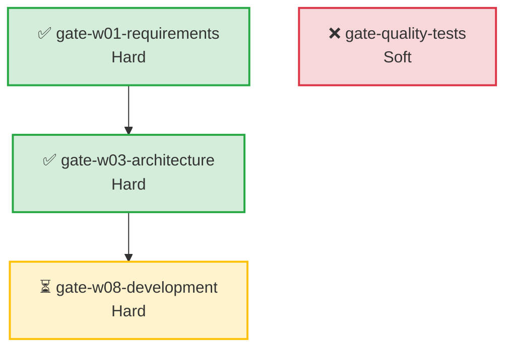

# /chaos-harness:gate-visualizer

可视化 Gate 状态，生成 Mermaid / ASCII 格式的状态图。

## 用途

- 查看当前所有 Gate 的状态（通过/失败/待运行）
- 理解 Gate 之间的依赖关系
- 定位阻塞原因（哪个 Gate 阻塞了后续 Gate）
- 生成可嵌入 PR 描述的状态图

## 使用方式

```
/chaos-harness:gate-visualizer                # ASCII 格式（终端）
/chaos-harness:gate-visualizer --mermaid      # Mermaid 格式（Markdown）
/chaos-harness:gate-visualizer --pr-description  # PR 描述格式
```

## 输出示例

### ASCII 格式（终端）

```
══════════════════════════════════════════════════════════════════
  Chaos Harness Gate 状态图
══════════════════════════════════════════════════════════════════

📍 阶段 Gates (Stage)
──────────────────────────────────────────────────────────────────
✅ 🔴 gate-w01-requirements
   需求阶段进入检查 — 自动扫描项目识别类型和技术栈
   状态: 通过 (2026-05-05 10:30:00)
   验证器: project-scan

✅ 🔴 gate-w03-architecture
   架构阶段进入检查
   状态: 通过 (2026-05-05 11:00:00)
   验证器: file-exists, prd-quality-check

🔒 🔴 gate-w08-development
   开发阶段进入检查
   🔒 阻塞原因: 依赖 gate-w03-architecture 未通过
   验证器: file-exists

🔍 质量 Gates (Quality)
──────────────────────────────────────────────────────────────────
✅ 🔴 gate-quality-iron-law
   铁律检查
   状态: 通过 (2026-05-05 09:00:00)
   触发: pre-tool-use

❌ 🟡 gate-quality-tests
   测试套件检查
   状态: 3 个测试失败
   触发: pre-commit

══════════════════════════════════════════════════════════════════
  总计: 11 Gates | ✅ 8 通过 | ❌ 1 失败 | ⏳ 2 待运行
══════════════════════════════════════════════════════════════════
```

### Mermaid 格式（可嵌入 Markdown）



### PR 描述格式

```markdown
## 🚦 Gate 检查状态

**总计:** 11 Gates | ✅ 8 通过 | ❌ 1 失败 | ⏳ 2 待运行

### ❌ 失败的 Gates

- **gate-quality-tests** (soft): 3 个测试失败

### ⏳ 待运行的 Gates

- **gate-w08-development**: 🔒 阻塞（依赖 gate-w03-architecture）
- **gate-w10-testing**: 待运行

<details>
<summary>✅ 已通过的 Gates</summary>

- **gate-w01-requirements** (hard)
- **gate-w03-architecture** (hard)
- **gate-quality-iron-law** (hard)
...

</details>

### 📊 Gate 依赖关系图

[Mermaid 图]
```

## 使用场景

1. **开发过程中** — 快速查看当前 Gate 状态，定位阻塞
2. **PR 提交前** — 生成 Gate 状态图，粘贴到 PR 描述
3. **团队协作** — 可视化 Gate 依赖关系，帮助新成员理解流程
4. **CI 集成** — 在 CI 日志中输出 ASCII 格式状态图

## 相关命令

- `/chaos-harness:gate-manager` — 管理 Gate 状态（transition/recheck/override）
- `/chaos-harness:ci-gate-check` — CI 环境 Gate 检查
- `/chaos-harness:gate-reporter` — 生成详细 Gate 报告
