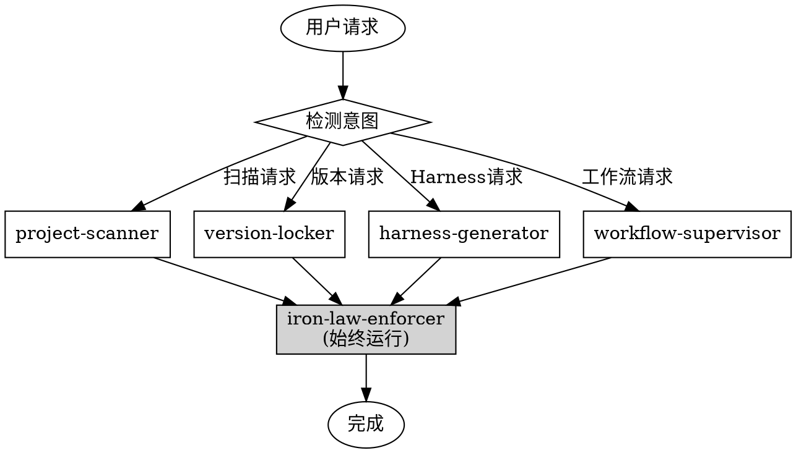

<SUBAGENT-STOP>
If you were dispatched as a subagent to execute a specific task, skip this skill.
</SUBAGENT-STOP>

<EXTREMELY-IMPORTANT>
**Iron Laws are NON-NEGOTIABLE.** 

If you think there is even a 1% chance an Iron Law applies, you MUST enforce it.

This is not optional. You cannot rationalize your way out of Iron Laws.
</EXTREMELY-IMPORTANT>

# Chaos Harness (万物入侵)

> **Chaos demands order. Harness provides it.**

## 核心铁律

以下铁律在所有情况下必须遵守：

| ID | 铁律 | 说明 |
|----|------|------|
| IL001 | NO DOCUMENTS WITHOUT VERSION LOCK | 所有文档必须在版本目录下 |
| IL002 | NO HARNESS WITHOUT SCAN RESULTS | Harness 需要项目扫描数据 |
| IL003 | NO COMPLETION CLAIMS WITHOUT VERIFICATION | 完成声明需要实际验证 |
| IL004 | NO VERSION CHANGES WITHOUT USER CONSENT | 版本变更需要用户确认 |
| IL005 | NO HIGH-RISK CONFIG MODIFICATIONS WITHOUT APPROVAL | 敏感配置修改需要批准 |

## 子 Skills

根据用户请求激活对应的子 skill：

| Skill | 激活条件 | 功能 |
|-------|---------|------|
| `project-scanner` | 扫描项目、分析项目结构 | 检测项目类型、环境、依赖 |
| `version-locker` | 创建版本、锁定版本 | 版本管理和锁定 |
| `harness-generator` | 生成 Harness、创建约束 | 生成铁律和防绕过规则 |
| `workflow-supervisor` | 工作流、阶段管理 | 12阶段工作流管理 |
| `iron-law-enforcer` | **始终激活** | 铁律执行和违规检测 |

## 工作流程



## 防绕过规则

自动检测并反驳常见借口：

| 借口 | 反驳 |
|------|------|
| "这是简单修复" | 简单也需要验证。IL003。 |
| "跳过测试" | 测试是基本验证。IL003。 |
| "就这一次" | 每次例外都是先例。IL001。 |
| "老项目" | 老项目更需要约束。IL003。 |

## 偷懒模式检测

| ID | 模式 | 严重程度 |
|----|------|----------|
| LP001 | 声称完成但无验证证据 | Critical |
| LP002 | 跳过根因分析直接修复 | Critical |
| LP003 | 长时间无产出 | Warning |
| LP004 | 试图跳过测试 | Critical |
| LP005 | 擅自更改版本号 | Critical |
| LP006 | 自动处理高风险配置 | Critical |

## 使用示例

**扫描项目：**
```
用户: 帮我扫描当前项目
→ 激活 project-scanner
→ 执行项目类型检测
→ 生成扫描报告
```

**生成 Harness：**
```
用户: 生成这个项目的 Harness
→ 检查版本是否锁定 (IL001)
→ 检查扫描结果是否存在 (IL002)
→ 激活 harness-generator
→ 生成铁律和防绕过规则
```

**检测偷懒：**
```
用户: 我完成了
→ 激活 iron-law-enforcer
→ 检查是否有验证证据 (IL003)
→ 无证据 → 要求验证
```

## 安装

```bash
# 从 GitHub 克隆
git clone https://github.com/jeesoul/chaos-harness.git
cd chaos-harness

# 安装
chmod +x install.sh
./install.sh  # macOS/Linux
install.bat    # Windows

# 重启 Claude Code
```

## 项目结构

```
chaos-harness/
├── .claude-plugin/
│   ├── plugin.json
│   └── marketplace.json
├── skills/
│   ├── project-scanner/
│   ├── version-locker/
│   ├── harness-generator/
│   ├── workflow-supervisor/
│   └── iron-law-enforcer/
├── templates/           # Harness 模板
├── CLAUDE.md           # 项目记忆
└── README.md
```

---

*Chaos demands order. Harness provides it.*