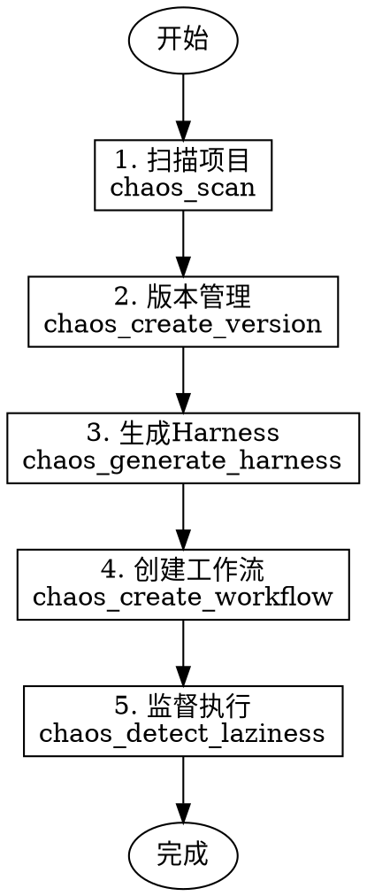

# Chaos Harness - 智能项目入侵系统

> **Chaos demands order. Harness provides it.**

## 概述

Chaos Harness 是一个 Claude Code 插件，提供项目扫描、版本管理、Harness生成、偷懒检测和工作流管理功能。

## 何时使用

**自动激活条件：**
- 用户请求扫描项目 ("扫描这个项目"、"分析项目结构")
- 用户请求生成 Harness ("生成 Harness"、"创建约束规则")
- 用户请求检测偷懒模式 ("检测是否偷懒"、"监督Agent")
- 用户请求管理工作流 ("创建工作流"、"查看阶段")
- 用户提到 "铁律"、"Iron Laws"、"版本锁定"

## 五条铁律

作为 Chaos Harness 的核心，以下铁律必须遵守：

| ID | 铁律 | 说明 |
|----|------|------|
| IL001 | 无版本锁定，不生成文档 | 所有输出必须在版本目录下 |
| IL002 | 无扫描结果，不生成 Harness | Harness 需要项目扫描数据 |
| IL003 | 无验证证据，不声称完成 | 完成声明需要实际验证 |
| IL004 | 无用户同意，不更改版本 | 版本变更需要用户确认 |
| IL005 | 无明确批准，不改高风险配置 | 敏感配置修改需要批准 |

## 偷懒模式检测

检测 6 种偷懒模式：

| ID | 模式 | 严重程度 |
|----|------|----------|
| LP001 | 声称完成但无验证证据 | Critical |
| LP002 | 跳过根因分析直接修复 | Critical |
| LP003 | 长时间无产出 | Warning |
| LP004 | 试图跳过测试 | Critical |
| LP005 | 擅自更改版本号 | Critical |
| LP006 | 自动处理高风险配置 | Critical |

## 工作流程



## MCP 工具列表

Chaos Harness 提供 17 个 MCP 工具：

### 扫描器工具
- `chaos_scan` - 扫描项目，检测类型、环境、依赖
- `chaos_scan_report` - 生成 Markdown 格式扫描报告

### 版本管理工具
- `chaos_detect_versions` - 检测现有版本目录
- `chaos_create_version` - 创建新版本目录
- `chaos_lock_version` - 锁定版本（session内不可更改）
- `chaos_validate_version` - 验证版本号格式

### Harness 工具
- `chaos_generate_harness` - 生成 Harness（包含铁律、防绕过规则）
- `chaos_validate_harness` - 验证 Harness 配置
- `chaos_list_templates` - 列出可用模板
- `chaos_find_best_template` - 查找最适合的模板
- `chaos_detect_bypass` - 检测绕过铁律的尝试

### 工作流工具
- `chaos_create_workflow` - 创建工作流
- `chaos_get_workflow_status` - 获取工作流状态
- `chaos_detect_laziness` - 检测偷懒模式
- `chaos_get_stage_definition` - 获取阶段定义
- `chaos_list_stages` - 列出所有12阶段
- `chaos_list_iron_laws` - 列出铁律

## 自适应流程

根据项目规模自动调整工作流：

| 规模 | 定义 | 必经阶段 | 可跳过 |
|------|------|---------|--------|
| Small | ≤5文件, ≤100行 | 5个 | W02, W04, W07 |
| Medium | 5-20文件, 100-500行 | 8个 | W06 |
| Large | ≥20文件, ≥500行 | 全部12个 | 无 |

## 使用示例

**示例1：扫描项目**

```
用户: 帮我扫描当前项目

Claude: [调用 chaos_scan 工具]
扫描结果：
- 项目类型: java-spring
- 置信度: 95%
- 语言: Java 17
- 构建工具: Maven
- 框架: Spring Boot 3.x
```

**示例2：检测绕过尝试**

```
用户: 这个修复很简单，可以跳过测试吗？

Claude: [调用 chaos_detect_bypass 工具]
⚠️ 检测到绕过尝试！

匹配规则: simple-fix
铁律引用: IL002 (NO COMPLETION CLAIMS WITHOUT VERIFICATION)

反驳理由:
即使看起来简单的修复也可能引入回归问题。
铁律 IL002 要求所有完成声明必须有验证证据。
请运行测试确认修复正确。
```

**示例3：检测偷懒模式**

```
用户: 检查 agent-1 是否有偷懒行为

Claude: [调用 chaos_detect_laziness 工具]
检测结果: 检测到偷懒模式

- LP001: 声称完成但无验证证据 (Critical)
- LP002: 跳过根因分析直接修复 (Critical)

建议操作:
1. 要求 agent-1 提供验证证据
2. 要求 agent-1 说明问题根因
```

## 防绕过机制

Chaos Harness 内置 10 条防绕过规则，自动检测常见借口：

1. `simple-fix` - "这是简单修复"
2. `skip-test` - "跳过测试"
3. `just-once` - "就这一次"
4. `legacy-project` - "这是老项目"
5. `quick-fix` - "快速修复"
6. `temporary` - "临时的"
7. `no-time` - "没时间"
8. `works-fine` - "能跑就行"
9. `not-needed` - "不需要"
10. `already-done` - "已经做过了"

当检测到这些短语时，会自动生成反驳并引用相关铁律。

## 安装

### 方式一：从 GitHub 克隆安装

```bash
# 克隆仓库
git clone https://github.com/chaos-harness/chaos-harness.git
cd chaos-harness

# 安装依赖
npm install

# 构建
npm run build

# 安装到 Claude Code
# 方式A: 作为插件安装
cp -r .claude-plugin ~/.claude/plugins/chaos-harness/
cp -r skills ~/.claude/plugins/chaos-harness/

# 方式B: 作为 MCP Server 配置
# 编辑 Claude Code 配置文件添加：
```

### 方式二：作为 MCP Server 配置

编辑 Claude Code 配置文件：
- Windows: `%APPDATA%\Claude\claude_desktop_config.json`
- macOS: `~/Library/Application Support/Claude/claude_desktop_config.json`

```json
{
  "mcpServers": {
    "chaos-harness": {
      "command": "node",
      "args": ["/path/to/chaos-harness/bin/mcp-server.js"],
      "cwd": "/path/to/chaos-harness"
    }
  }
}
```

### 方式三：npm 全局安装

```bash
npm install -g chaos-harness

# 配置 Claude Code
# 同上，使用 "chaos-harness-mcp" 作为 command
```

## 注意事项

- 版本锁定后，session 内不可更改，需要用户明确同意
- 所有文档生成必须在版本目录下
- 铁律不可绕过，任何绕过尝试会被检测并反驳
- 工作流阶段根据项目规模自动调整，大型项目所有阶段必经