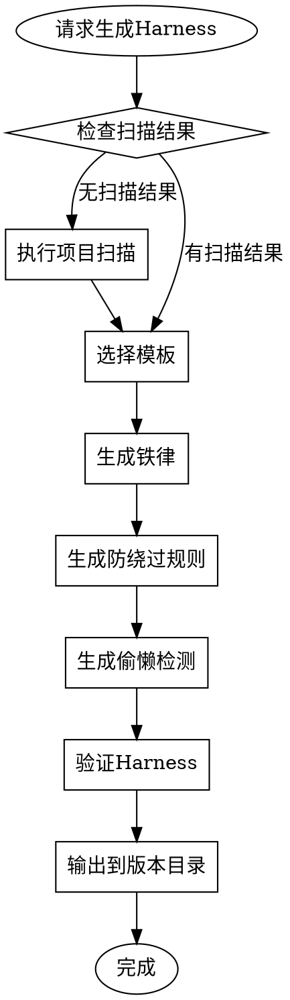

# Harness 生成器 (Harness Generator)

## 铁律

```
NO HARNESS WITHOUT SCAN RESULTS
```

## 执行规则

**加载此 skill 后，你必须按顺序执行以下步骤：**

### Step 1: 检查前置条件

**必须检查：**
1. 版本是否已锁定？使用 Read 检查 `output/{version}/VERSION-LOCK`
2. 扫描结果是否存在？使用 Read 检查 `output/{version}/scan-result.json`

如果缺少：
- 版本未锁定 → 使用 Skill tool 执行 `chaos-harness:version-locker`
- 扫描结果不存在 → 使用 Skill tool 执行 `chaos-harness:project-scanner`

### Step 2: 读取扫描结果

使用 Read 工具读取扫描结果，获取项目类型。

### Step 3: 选择 Harness 模板

根据项目类型选择：

| 项目类型 | 模板 |
|---------|------|
| java-spring | java-spring 模板 |
| java-spring-legacy | java-spring-legacy 模板 |
| node-express | node-express 模板 |
| python-django | python-django 模板 |
| 其他 | generic 模板 |

### Step 4: 生成 Harness 文件

使用 Write 工具创建 `output/{version}/Harness/harness.yaml`

### Step 5: 生成防绕过规则

使用 Write 工具创建 `output/{version}/Harness/anti-bypass.yaml`

### Step 6: 确认生成

输出确认信息：

```
✅ Harness 已生成

位置: output/{version}/Harness/

核心铁律:
- IL001: NO DOCUMENTS WITHOUT VERSION LOCK
- IL002: NO HARNESS WITHOUT SCAN RESULTS
- IL003: NO COMPLETION CLAIMS WITHOUT VERIFICATION
- IL004: NO VERSION CHANGES WITHOUT USER CONSENT
- IL005: NO HIGH-RISK CONFIG MODIFICATIONS WITHOUT APPROVAL
```

## 何时使用

**必须激活的条件：**
- 用户说 "生成 Harness"
- 用户说 "创建约束规则"
- 用户请求配置铁律
- 用户请求生成项目约束

## 前置条件

**必须先完成项目扫描**

如果没有扫描结果：
1. 提示用户需要先扫描项目
2. 激活 `project-scanner` skill
3. 等待扫描完成后继续

## Harness 结构

```yaml
# Harness 配置文件
# 由 Chaos Harness 自动生成

identity:
  name: "项目名称"
  type: java-spring  # 项目类型
  created: 2026-04-02
  version: v0.1

# 激活条件
activation:
  confidence_threshold: 0.8
  triggers:
    - file_pattern: "pom.xml"
    - framework: "spring-boot"

# 五条铁律
iron_laws:
  - id: IL001
    rule: "NO DOCUMENTS WITHOUT VERSION LOCK"
    description: "所有文档必须在版本目录下生成"
    enforcement:
      - "拒绝生成无版本路径的文档"
      - "提示用户创建或选择版本"

  - id: IL002
    rule: "NO HARNESS WITHOUT SCAN RESULTS"
    description: "Harness 需要项目扫描数据"
    enforcement:
      - "检查扫描结果是否存在"
      - "无扫描结果时触发项目扫描"

  - id: IL003
    rule: "NO COMPLETION CLAIMS WITHOUT VERIFICATION"
    description: "完成声明需要实际验证"
    enforcement:
      - "要求提供测试结果"
      - "要求提供验证命令执行输出"

  - id: IL004
    rule: "NO VERSION CHANGES WITHOUT USER CONSENT"
    description: "版本变更需要用户确认"
    enforcement:
      - "检测版本更改请求"
      - "要求用户明确同意"

  - id: IL005
    rule: "NO HIGH-RISK CONFIG MODIFICATIONS WITHOUT APPROVAL"
    description: "敏感配置修改需要批准"
    enforcement:
      - "识别高风险配置文件"
      - "请求用户批准"

# 防绕过规则
anti_bypass:
  - id: "simple-fix"
    pattern: "这是简单修复|很简单|小修改"
    iron_law_ref: "IL003"
    rebuttal: |
      即使看起来简单的修复也可能引入回归问题。
      铁律 IL003 要求所有完成声明必须有验证证据。
      请运行相关测试并提供结果。

  - id: "skip-test"
    pattern: "跳过测试|不写测试|测试不重要"
    iron_law_ref: "IL003"
    rebuttal: |
      跳过测试违反质量标准。
      铁律 IL003 要求验证证据，测试是最基本的验证方式。

  - id: "just-once"
    pattern: "就这一次|特殊情况|临时处理"
    iron_law_ref: "IL001"
    rebuttal: |
      "就这一次" 是最常见的偷懒借口。
      每一次例外都会成为先例。

  - id: "legacy-project"
    pattern: "老项目|历史代码|遗留系统"
    iron_law_ref: "IL003"
    rebuttal: |
      历史项目更需要严格的约束。
      正因为历史代码复杂，才更需要验证。

# 偷懒模式检测
laziness_patterns:
  - id: LP001
    pattern: "声称完成但无验证证据"
    severity: critical
    detection:
      claimed_completion: true
      ran_verification: false

  - id: LP002
    pattern: "跳过根因分析直接修复"
    severity: critical
    detection:
      proposed_fix: true
      mentioned_root_cause: false

  - id: LP003
    pattern: "长时间无产出"
    severity: warning
    detection:
      time_elapsed: "> 1.5x expected"

# 漏洞封堵
loophole_closure:
  - pattern: "用户未指定版本"
    closure: "使用默认版本 v0.1 或提示用户选择"
    
  - pattern: "声称测试通过但无证据"
    closure: "要求提供测试执行输出"

# 说服力原则
persuasion:
  - principle: authority
    application: "引用铁律作为权威依据"
    
  - principle: commitment
    application: "提醒用户之前的承诺"
```

## 模板选择

| 项目类型 | 模板 | 特点 |
|---------|------|------|
| `java-spring` | java-spring | Java 17/21, Spring Boot 3.x |
| `java-spring-legacy` | java-spring-legacy | JDK 8, Spring Boot 2.x |
| `node-express` | node-express | Node.js Express |
| `python-django` | python-django | Python Django |
| 其他 | generic | 通用模板 |

## 生成流程



## 铁律检查

生成 Harness 时必须检查：

| 检查项 | 失败处理 |
|--------|---------|
| 版本是否锁定 | 提示用户先锁定版本 |
| 扫描结果是否存在 | 执行项目扫描 |
| 输出路径是否正确 | 纠正到版本目录 |

## 输出要求

1. **必须** 输出到版本目录下的 `Harness/` 子目录
2. **必须** 包含完整的铁律定义
3. **必须** 包含防绕过规则
4. **必须** 包含偷懒模式检测配置
5. **应该** 根据项目类型选择合适模板