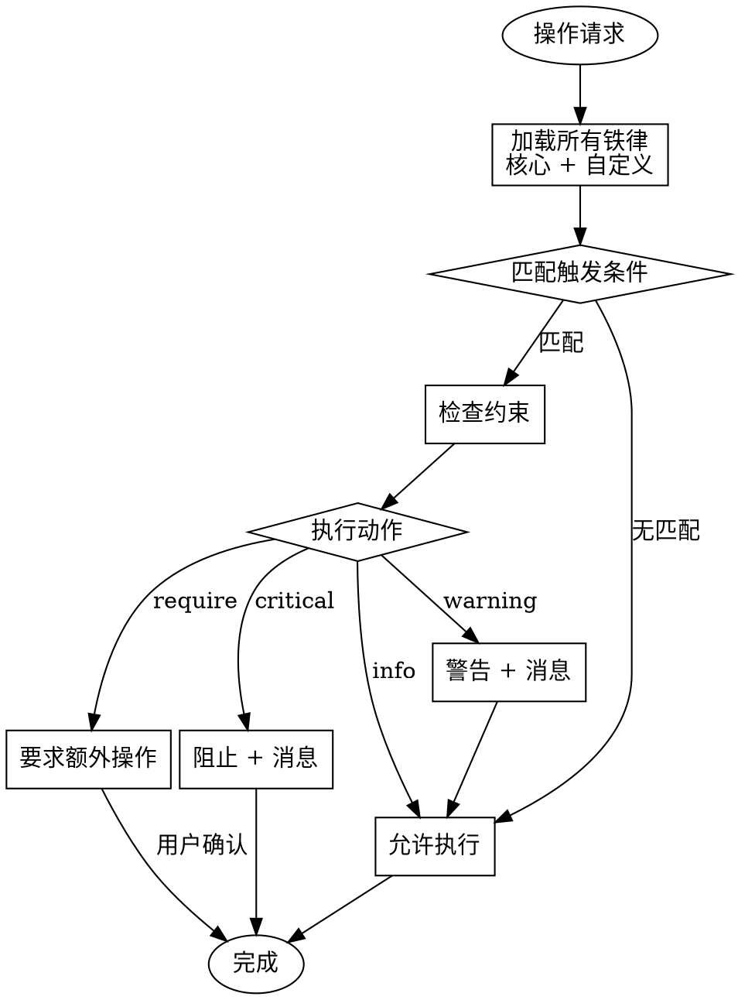

<SUBAGENT-STOP>
If you were dispatched as a subagent to execute a specific task, skip this skill.
</SUBAGENT-STOP>

<EXTREMELY-IMPORTANT>
**Iron Laws are NON-NEGOTIABLE.**

铁律是不可协商的规则。用户可以新增铁律，但不能禁用核心铁律。
</EXTREMELY-IMPORTANT>

# 铁律执行器 (Iron Law Enforcer)

## 执行规则

**此 skill 在以下情况自动激活：**
- 检测到完成声明
- 检测到可能的绕过尝试
- 用户请求查看铁律
- 需要验证操作合规性

### Step 1: 列出所有铁律

输出核心铁律表格：

```
┌─────────────────────────────────────────────────────────────┐
│  Iron Laws (铁律) - 不可协商                                 │
├─────────────────────────────────────────────────────────────┤
│  ID     │ 铁律                                    │ 严重程度 │
├─────────────────────────────────────────────────────────────┤
│  IL001  │ NO DOCUMENTS WITHOUT VERSION LOCK      │ critical │
│  IL002  │ NO HARNESS WITHOUT SCAN RESULTS        │ critical │
│  IL003  │ NO COMPLETION CLAIMS WITHOUT VERIFICATION │ critical │
│  IL004  │ NO VERSION CHANGES WITHOUT USER CONSENT   │ critical │
│  IL005  │ NO HIGH-RISK CONFIG MODS WITHOUT APPROVAL │ critical │
└─────────────────────────────────────────────────────────────┘
```

### Step 2: 检查用户自定义铁律

使用 Read 工具检查 `.claude/harness/iron-laws.yaml` 是否存在。

### Step 3: 执行铁律检查

根据当前操作检查相关铁律：

**完成声明检查 (IL003)：**
```
IF 用户声称"完成了" OR "搞定了" THEN
    ASK: 请提供验证证据（测试结果、命令输出等）
END IF
```

**绕过检测：**
```
IF 检测到 "简单修复" OR "跳过测试" OR "就这一次" THEN
    WARN: 检测到绕过尝试
    OUTPUT: 对应的反驳信息
END IF
```

### Step 4: 记录铁律触发

使用 Edit 或 Write 工具更新 `.claude/harness/iron-law-log.json`

## 核心铁律（不可禁用）

以下铁律是 Harness 的核心，不可禁用：

| ID | 铁律 | 说明 |
|----|------|------|
| **IL001** | NO DOCUMENTS WITHOUT VERSION LOCK | 所有输出必须在版本目录下 |
| **IL002** | NO HARNESS WITHOUT SCAN RESULTS | Harness 需要项目扫描数据 |
| **IL003** | NO COMPLETION CLAIMS WITHOUT VERIFICATION | 完成声明需要实际验证 |
| **IL004** | NO VERSION CHANGES WITHOUT USER CONSENT | 版本变更需要用户确认 |
| **IL005** | NO HIGH-RISK CONFIG MODIFICATIONS WITHOUT APPROVAL | 敏感配置修改需要批准 |

## 用户自定义铁律

用户可以在 `.claude/harness/iron-laws.yaml` 中定义自己的铁律：

```yaml
# 用户自定义铁律
custom_iron_laws:
  # 项目特定铁律
  - id: IL-C001
    rule: "NO DATABASE CHANGES WITHOUT BACKUP"
    description: "数据库变更前必须创建备份"
    severity: critical
    triggers:
      - pattern: "ALTER TABLE|DROP TABLE|TRUNCATE"
        action: block
        message: "数据库结构变更需要先创建备份"
    enforcement:
      - "检查是否有备份命令执行"
      - "要求用户提供备份确认"

  - id: IL-C002
    rule: "NO DEPLOYMENT ON FRIDAY"
    description: "周五禁止部署"
    severity: warning
    triggers:
      - condition: "day_of_week == Friday"
        action: warn
        message: "今天是周五，建议周一再部署"
    enforcement:
      - "检查当前日期"
      - "提示风险"

  - id: IL-C003
    rule: "NO API CHANGES WITHOUT DOCUMENTATION"
    description: "API 变更必须同步更新文档"
    severity: critical
    triggers:
      - pattern: "@RequestMapping|@GetMapping|@PostMapping"
        action: require
        message: "API 变更需要更新 API 文档"
    enforcement:
      - "检查是否有文档更新"
      - "要求用户提供文档链接"

  # 团队规范铁律
  - id: IL-C010
    rule: "NO DIRECT MAIN MERGE"
    description: "禁止直接合并到主分支"
    severity: critical
    triggers:
      - pattern: "git push origin main|git merge main"
        action: block
        message: "请使用 PR 流程，不要直接推送主分支"
    enforcement:
      - "阻止直接推送"
      - "引导使用 PR 流程"

  # 技术栈特定铁律
  - id: IL-C020
    rule: "NO @Autowired ON FIELDS"
    description: "Spring 项目禁止字段注入"
    severity: warning
    triggers:
      - pattern: "@Autowired\\s+private"
        action: warn
        message: "推荐使用构造器注入而非字段注入"
    enforcement:
      - "检测代码模式"
      - "建议重构"
```

## 铁律配置结构

```yaml
# .claude/harness/iron-laws.yaml

# 核心铁律配置（只读）
core_iron_laws:
  IL001: { enabled: true, locked: true }  # 不可禁用
  IL002: { enabled: true, locked: true }
  IL003: { enabled: true, locked: true }
  IL004: { enabled: true, locked: true }
  IL005: { enabled: true, locked: true }

# 用户自定义铁律
custom_iron_laws:
  - id: IL-C001
    rule: "..."
    # ... (如上)

# 铁律继承（从其他来源）
inherit_iron_laws:
  - source: team-config
    path: ~/.config/team/iron-laws.yaml
  - source: project-config
    path: ./project-iron-laws.yaml

# 铁律优先级
priority:
  core: 1000        # 核心铁律最高优先级
  team: 500         # 团队配置次之
  project: 300      # 项目配置
  user: 100         # 用户配置最低
```

## 铁律 ID 命名规范

| 前缀 | 说明 | 示例 |
|------|------|------|
| `IL001-IL099` | 核心铁律（保留） | `IL001` |
| `IL-C001-IL-C099` | 用户自定义 | `IL-C001` |
| `IL-T001-IL-T099` | 团队铁律 | `IL-T001` |
| `IL-P001-IL-P099` | 项目铁律 | `IL-P001` |
| `IL-J001-IL-J099` | Java 栈特定 | `IL-J001` |
| `IL-N001-IL-N099` | Node 栈特定 | `IL-N001` |

## 铁律执行流程



## 铁律严重程度

| 级别 | 行为 | 示例 |
|------|------|------|
| `critical` | 阻止操作，显示消息 | 无版本锁定，阻止文档生成 |
| `warning` | 允许操作，显示警告 | 周五部署警告 |
| `info` | 允许操作，显示提示 | 字段注入建议 |
| `require` | 要求用户执行额外操作 | API 变更需要更新文档 |

## 添加铁律的方式

### 方式一：对话添加

```
你: 添加一条铁律：数据库变更前必须创建备份

Claude: 好的，请确认铁律详情：

┌─────────────────────────────────────────────────────────┐
│  ID: IL-C001 (自动生成)                                 │
│  Rule: NO DATABASE CHANGES WITHOUT BACKUP               │
│  Description: 数据库变更前必须创建备份                   │
│  Severity: critical                                     │
│                                                         │
│  触发条件：                                              │
│  - 检测到 SQL: ALTER TABLE, DROP TABLE, TRUNCATE        │
│                                                         │
│  执行动作：阻止 + 要求备份确认                           │
└─────────────────────────────────────────────────────────┘

确认添加？(是的/取消)

你: 是的

Claude: ✅ 铁律 IL-C001 已添加
        配置已保存到 .claude/harness/iron-laws.yaml
```

### 方式二：配置文件添加

在 `.claude/harness/iron-laws.yaml` 中直接编辑：

```yaml
custom_iron_laws:
  - id: IL-C001
    rule: "NO DATABASE CHANGES WITHOUT BACKUP"
    description: "数据库变更前必须创建备份"
    severity: critical
    # ...
```

### 方式三：团队共享

将铁律配置提交到项目仓库：

```
project/
├── .claude/
│   └── harness/
│       ├── iron-laws.yaml      # 项目铁律
│       └── plugins.yaml        # 插件配置
└── ...
```

## 铁律模板库

提供常用铁律模板：

```bash
# 列出可用模板
harness iron-law templates

# 应用模板
harness iron-law apply database-safety
harness iron-law apply no-friday-deploy
harness iron-law apply security-first
```

**可用模板：**

| 模板 | 包含铁律 |
|------|---------|
| `database-safety` | 数据库备份、变更审核 |
| `no-friday-deploy` | 周五禁止部署 |
| `security-first` | 安全审计、敏感数据处理 |
| `api-documentation` | API 变更需要文档 |
| `code-review-required` | 代码审查强制 |
| `test-coverage` | 测试覆盖率要求 |

## 铁律管理命令

```bash
# 列出所有铁律
harness iron-law list

# 查看铁律详情
harness iron-law show IL-C001

# 添加铁律
harness iron-law add "NO XXXX" --severity critical

# 禁用铁律（仅限自定义）
harness iron-law disable IL-C001

# 启用铁律
harness iron-law enable IL-C001

# 删除铁律（仅限自定义）
harness iron-law remove IL-C001

# 导出铁律配置
harness iron-law export > my-iron-laws.yaml

# 导入铁律配置
harness iron-law import team-iron-laws.yaml

# 验证铁律配置
harness iron-law validate
```

## 铁律日志

所有铁律触发记录在 `.claude/harness/iron-law-log.json`：

```json
[
  {
    "timestamp": "2026-04-02T23:30:00Z",
    "iron_law": "IL-C001",
    "trigger": "ALTER TABLE users ADD COLUMN",
    "action": "blocked",
    "message": "数据库结构变更需要先创建备份",
    "user_response": "已创建备份，继续执行"
  }
]
```

## 与插件系统的集成

插件必须声明遵守的铁律：

```yaml
# 插件配置
name: my-plugin
accepts_constraints:
  iron_laws:
    - IL001-IL005   # 必须接受核心铁律
    - IL-C001       # 可选接受用户铁律
  enforcement: strict  # strict | warn | ignore
```

如果插件拒绝接受核心铁律，将被拒绝加载。