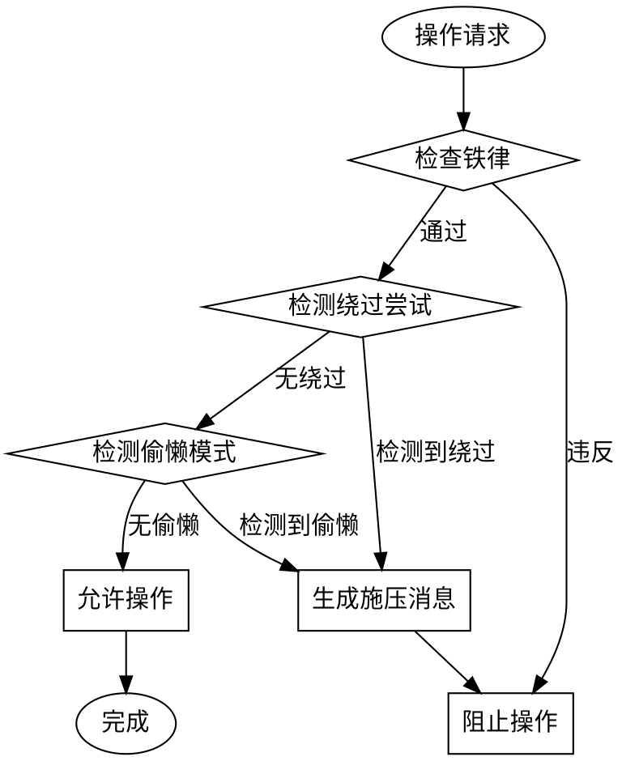

# 铁律执行器 (Iron Law Enforcer)

## 核心原则

**这是 Chaos Harness 的核心 skill，必须始终激活。**

铁律是不可协商的规则。任何绕过尝试都会被检测和拒绝。

## 五条铁律

### IL001: 无版本锁定，不生成文档

```
NO DOCUMENTS WITHOUT VERSION LOCK
```

**含义：** 所有文档输出必须在用户确认的版本目录下。

**检查时机：**
- 生成任何文档之前
- 创建新文件之前
- 输出报告之前

**违规处理：**
1. 停止文档生成
2. 提示用户创建或选择版本
3. 等待版本锁定后继续

---

### IL002: 无扫描结果，不生成 Harness

```
NO HARNESS WITHOUT SCAN RESULTS
```

**含义：** Harness 生成需要项目扫描数据作为输入。

**检查时机：**
- 生成 Harness 之前
- 配置约束规则之前

**违规处理：**
1. 检查是否存在扫描结果
2. 无结果时触发项目扫描
3. 扫描完成后继续

---

### IL003: 无验证证据，不声称完成

```
NO COMPLETION CLAIMS WITHOUT FRESH VERIFICATION EVIDENCE
```

**含义：** 任何完成声明必须有实际验证证据支持。

**验证证据包括：**
- 测试执行输出（通过/失败）
- 命令执行结果
- 截图或日志
- 代码审查确认

**检查时机：**
- 声称任务完成时
- 提交代码时
- 关闭 issue 时

**违规处理：**
1. 拒绝完成声明
2. 要求提供验证证据
3. 提供需要执行的验证命令

---

### IL004: 无用户同意，不更改版本

```
NO VERSION CHANGES WITHOUT USER CONSENT
```

**含义：** 版本号在 session 内锁定后，更改需要用户明确同意。

**检查时机：**
- 检测到版本更改请求
- 检测到新版本目录创建

**违规处理：**
1. 警告当前版本已锁定
2. 询问用户是否确定更改
3. 等待明确同意（"是的"、"确定"、"同意"）

---

### IL005: 无明确批准，不改高风险配置

```
NO HIGH-RISK CONFIG MODIFICATIONS WITHOUT EXPLICIT APPROVAL
```

**含义：** 敏感配置修改需要用户明确批准。

**高风险配置包括：**
- 私服配置（settings.xml, .npmrc）
- 认证信息（credentials, secrets）
- 生产环境配置
- 数据库连接
- API 密钥

**检查时机：**
- 修改配置文件时
- 添加/删除依赖源时
- 更改认证信息时

**违规处理：**
1. 识别为高风险操作
2. 列出具体修改内容
3. 请求用户明确批准

---

## 防绕过规则

检测常见的绕过借口并生成反驳：

| 模式ID | 模式 | 反驳 |
|--------|------|------|
| `simple-fix` | "这是简单修复" | 简单修复也需要验证。IL003 要求验证证据。 |
| `skip-test` | "跳过测试" | 测试是验证的基本方式。IL003 不允许跳过。 |
| `just-once` | "就这一次" | 每一次例外都是先例。IL001 无例外。 |
| `legacy-project` | "这是老项目" | 老项目更需要约束。IL003 适用于所有项目。 |
| `quick-fix` | "快速修复" | 快速不代表可以跳过验证。IL003 生效。 |
| `temporary` | "临时的" | 临时的会变成永久的。IL001 要求版本锁定。 |
| `no-time` | "没时间" | 没时间不是跳过验证的理由。IL003 生效。 |
| `works-fine` | "能跑就行" | 能跑不代表正确。IL003 要求验证证据。 |
| `not-needed` | "不需要" | 不需要验证是偷懒借口。IL003 生效。 |
| `already-done` | "已经做过了" | 需要提供做过的证据。IL003 要求验证。 |

## 偷懒模式检测

### 检测逻辑

```typescript
function detectLaziness(context) {
  const patterns = [];

  // LP001: 声称完成但无验证证据
  if (context.claimedCompletion && !context.ranVerification) {
    patterns.push('LP001');
  }

  // LP002: 跳过根因分析直接修复
  if (context.proposedFix && !context.mentionedRootCause) {
    patterns.push('LP002');
  }

  // LP003: 长时间无产出
  if (context.timeElapsed > context.expectedTime * 1.5) {
    patterns.push('LP003');
  }

  // LP004: 试图跳过测试
  if (context.claimedCompletion && !context.testsPassed) {
    patterns.push('LP004');
  }

  // LP005: 擅自更改版本号
  if (context.createdVersionDir && !context.userApproved) {
    patterns.push('LP005');
  }

  // LP006: 自动处理高风险配置
  if (context.modifiedHighRiskConfig && !context.userApproved) {
    patterns.push('LP006');
  }

  return patterns;
}
```

### 严重程度

| 模式 | 严重程度 | 处理方式 |
|------|---------|---------|
| LP001 | Critical | 阻止，要求验证 |
| LP002 | Critical | 阻止，要求根因分析 |
| LP003 | Warning | 警告，询问进度 |
| LP004 | Critical | 阻止，要求测试通过 |
| LP005 | Critical | 阻止，要求用户同意 |
| LP006 | Critical | 阻止，要求用户批准 |

## 施压消息模板

当检测到偷懒模式时，生成施压消息：

### LP001 模板

```
🚨 **铁律违规: IL003**
声称完成需要验证证据！

请提供以下之一：
- 测试执行输出
- 命令执行结果
- 代码审查确认

没有证据 = 没有完成。
```

### LP002 模板

```
🔍 **根因分析缺失**
修复前必须调查根因！

请回答：
- 问题为什么会发生？
- 根因是什么？
- 这个修复如何解决根因？

没有根因分析 = 治标不治本。
```

### LP003 模板

```
⏰ **时间警告**
任务已超预期时间 50%。

请更新：
- 当前进度？
- 遇到什么问题？
- 需要什么帮助？
```

## 执行流程



## 始终激活

此 skill 作为核心约束，在以下情况**自动激活**：

1. **每次对话开始时** - 加载铁律到上下文
2. **每次操作前** - 检查是否违反铁律
3. **每次声称完成时** - 要求验证证据
4. **每次修改配置时** - 检查是否高风险

**这是不可禁用的 skill。**