<STATE-WRITE-REQUIRED>
**阶段变更后必须写入状态：**
1. 使用 Edit 工具更新 `.chaos-harness/state.json` 的产品阶段状态
2. 使用 Edit 工具更新 `output/{version}/product-state.yaml`
3. 使用 Edit 工具追加到 `~/.claude/harness/workflow-log.json`

调用 `shared/state-helpers.md` 中的函数：
- Update-Stage-Status(stage, status)

不写入状态 = 违反 IL003（完成声明需要验证证据）
</STATE-WRITE-REQUIRED>

# 产品全生命周期管理 (Product Lifecycle)

## 执行规则

**加载此 skill 后，你必须执行以下步骤：**

### Step 1: 检测当前阶段

使用 Read 检查 `output/{version}/product-state.yaml`：
- 存在 → 恢复当前阶段
- 不存在 → 从 P01 开始新流程

### Step 2: 显示阶段状态

```
┌─────────────────────────────────────────────────────────────┐
│  产品研发流程状态                                            │
├─────────────────────────────────────────────────────────────┤
│  版本: {version}                                             │
│  当前阶段: {stage}                                           │
│  完成度: {percentage}%                                       │
│  待处理: {pending items}                                     │
└─────────────────────────────────────────────────────────────┘
```

### Step 3: 执行当前阶段

根据阶段执行对应流程（见 10 阶段定义）

### Step 4: 阶段验证与记忆

每个阶段完成后：
1. 执行自验证检查点
2. 写入阶段记忆到 `output/{version}/memory/{stage}-memory.md`
3. 更新 `product-state.yaml`
4. 触发学习记录

## 10 阶段研发流程

```dot
digraph product_lifecycle {
    rankdir=LR;
    
    P01 [label="P01\n需求收集", shape=box, style=filled, fillcolor="#E3F2FD"];
    P02 [label="P02\n需求分析", shape=box, style=filled, fillcolor="#E3F2FD"];
    P03 [label="P03\n原型设计", shape=box, style=filled, fillcolor="#E8F5E9"];
    P04 [label="P04\n技术方案", shape=box, style=filled, fillcolor="#E8F5E9"];
    P05 [label="P05\n开发规划", shape=box, style=filled, fillcolor="#FFF3E0"];
    P06 [label="P06\n前端开发", shape=box, style=filled, fillcolor="#FFF3E0"];
    P07 [label="P07\n后端开发", shape=box, style=filled, fillcolor="#FFF3E0"];
    P08 [label="P08\n集成测试", shape=box, style=filled, fillcolor="#FCE4EC"];
    P09 [label="P09\n验收交付", shape=box, style=filled, fillcolor="#F3E5F5"];
    P10 [label="P10\n迭代优化", shape=box, style=filled, fillcolor="#E0E0E0"];
    
    P01 -> P02 -> P03 -> P04 -> P05 -> P06 -> P07 -> P08 -> P09 -> P10;
    P10 -> P01 [label="下一迭代", style=dashed];
}
```



---

## P01: 需求收集

### 输入
- 用户访谈记录
- 市场调研数据
- 竞品分析报告
- 业务方需求描述

### 活动

1. **需求来源识别**
   - 用户反馈渠道：客服、问卷、访谈
   - 数据分析：埋点数据、用户行为
   - 业务目标：KPI、战略规划
   - 竞品动态：功能对比、差异化

2. **需求池构建**
   - 使用 Write 创建 `output/{version}/requirements/pool.md`
   - 分类：功能性、非功能性、优化类
   - 优先级：P0(必须) / P1(重要) / P2(一般) / P3(可选)

3. **干系人识别**
   - 产品负责人
   - 技术负责人
   - 设计师
   - 测试负责人

### 输出
- `output/{version}/requirements/pool.md` - 需求池
- `output/{version}/requirements/sources.md` - 需求来源分析
- `output/{version}/stakeholders.md` - 干系人列表

### 验证检查点
- [ ] 需求来源是否标注清晰？
- [ ] 每个需求是否有优先级？
- [ ] 干系人是否全部识别？
- [ ] 需求是否可追溯到来源？

### 记忆写入
```yaml
# output/{version}/memory/P01-memory.yaml
stage: P01
completed_at: {timestamp}
requirements_count: {count}
priority_distribution:
  P0: {count}
  P1: {count}
  P2: {count}
  P3: {count}
stakeholders: [list]
key_insights: [关键发现]
```

---

## P02: 需求分析

### 输入
- 需求池
- 需求来源分析
- 干系人列表

### 活动

1. **PRD 编写**
   - 使用模板 `templates/product-lifecycle/prd-template.md`
   - 包含：背景、目标、用户故事、功能清单、非功能需求
   - 写入 `output/{version}/docs/PRD.md`

2. **关键信息识别**
   - 核心功能点（MVP）
   - 业务规则
   - 数据实体
   - 用户角色权限

3. **优先级排序**
   - Kano 模型分类：基本型、期望型、兴奋型
   - 价值/成本矩阵
   - MVP 范围确定

4. **风险评估**
   - 技术风险
   - 业务风险
   - 资源风险

### 输出
- `output/{version}/docs/PRD.md` - 产品需求文档
- `output/{version}/requirements/mvp-scope.md` - MVP 范围定义
- `output/{version}/requirements/risk-assessment.md` - 风险评估报告

### 验证检查点
- [ ] PRD 是否完整？（背景、目标、功能、非功能）
- [ ] MVP 范围是否明确？
- [ ] 每个功能是否可测试？
- [ ] 风险是否有应对方案？
- [ ] 干系人是否确认？

### 铁律检查
| 铁律 | 检查项 |
|------|--------|
| IL-PRD001 | PRD 必须包含验收标准 |
| IL-PRD002 | 用户故事必须可追溯 |
| IL-PRD003 | 技术方案变更需要记录原因 |

### 记忆写入
```yaml
# output/{version}/memory/P02-memory.yaml
stage: P02
completed_at: {timestamp}
prd_version: {version}
mvp_features: [MVP 功能列表]
risk_count: {count}
stakeholder_approved: true/false
```

---

## P03: 原型设计

### 输入
- PRD 文档
- MVP 范围
- 用户角色定义

### 活动

1. **信息架构设计**
   - 导航结构
   - 页面层级
   - 内容分类

2. **交互流程设计**
   - 用户旅程地图
   - 核心流程图
   - 异常流程处理

3. **UI 原型**
   - 低保真原型（手绘/Axure）
   - 高保真原型（Figma/Sketch）
   - 设计规范（颜色、字体、组件）

4. **设计评审**
   - 内部评审
   - 干系人确认
   - 迭代修改

### 输出
- `output/{version}/design/ia-diagram.md` - 信息架构图
- `output/{version}/design/user-flow.md` - 用户流程图
- `output/{version}/design/prototypes/` - 原型文件目录
- `output/{version}/design/design-system.md` - 设计规范

### 验证检查点
- [ ] 核心流程是否覆盖所有用户角色？
- [ ] 异常流程是否有处理方案？
- [ ] 设计是否符合品牌规范？
- [ ] 原型是否可交互演示？
- [ ] 干系人是否签字确认？

### 工具集成
- **ui-ux-pro-max**：UI/UX 设计评审
- **superpowers-chrome**：浏览器原型预览

### 记忆写入
```yaml
# output/{version}/memory/P03-memory.yaml
stage: P03
completed_at: {timestamp}
screens_count: {count}
user_flows: [流程列表]
design_review_passed: true/false
revision_count: {count}
```

---

## P04: 技术方案

### 输入
- PRD 文档
- 原型设计
- 现有系统架构

### 活动

1. **架构设计**
   - 系统架构图
   - 数据架构
   - 部署架构
   - 技术选型理由

2. **API 设计**
   - 接口列表
   - 请求/响应格式
   - 错误码定义
   - 接口文档（OpenAPI）

3. **数据库设计**
   - ER 图
   - 表结构定义
   - 索引设计
   - 数据迁移方案

4. **技术风险评估**
   - 性能瓶颈
   - 安全风险
   - 依赖风险

### 输出
- `output/{version}/tech/architecture.md` - 架构设计文档
- `output/{version}/tech/api-design.md` - API 设计文档
- `output/{version}/tech/database-design.md` - 数据库设计
- `output/{version}/tech/tech-review.md` - 技术评审报告

### 验证检查点
- [ ] 架构是否支持扩展？
- [ ] API 是否符合 RESTful 规范？
- [ ] 数据库设计是否满足第三范式？
- [ ] 是否有性能测试方案？
- [ ] 安全方案是否完整？

### 铁律检查
| 铁律 | 检查项 |
|------|--------|
| IL-TECH001 | 技术选型必须有对比分析 |
| IL-TECH002 | API 变更需要版本管理 |
| IL-TECH003 | 数据库变更需要迁移脚本 |

### 记忆写入
```yaml
# output/{version}/memory/P04-memory.yaml
stage: P04
completed_at: {timestamp}
tech_stack:
  frontend: {tech}
  backend: {tech}
  database: {tech}
api_count: {count}
tech_review_passed: true/false
```

---

## P05: 开发规划

### 输入
- 技术方案
- MVP 范围
- 团队资源

### 活动

1. **任务分解**
   - 前端任务列表
   - 后端任务列表
   - 依赖关系图

2. **里程碑规划**
   - 阶段划分
   - 时间估算
   - 关键路径

3. **资源分配**
   - 人员分配
   - 环境准备
   - 工具配置

4. **风险预案**
   - 风险清单
   - 应对措施
   - 回滚方案

### 输出
- `output/{version}/plan/task-breakdown.md` - 任务分解
- `output/{version}/plan/milestones.md` - 里程碑计划
- `output/{version}/plan/resource-allocation.md` - 资源分配
- `output/{version}/plan/risk-plan.md` - 风险预案

### 验证检查点
- [ ] 任务是否可独立交付？
- [ ] 依赖关系是否明确？
- [ ] 时间估算是否合理？
- [ ] 资源是否充足？
- [ ] 是否有 buffer 时间？

### 铁律检查
| 铁律 | 检查项 |
|------|--------|
| IL-PLAN001 | 每个任务必须有负责人 |
| IL-PLAN002 | 时间估算必须有依据 |
| IL-PLAN003 | 关键路径必须有 buffer |

### 记忆写入
```yaml
# output/{version}/memory/P05-memory.yaml
stage: P05
completed_at: {timestamp}
total_tasks: {count}
frontend_tasks: {count}
backend_tasks: {count}
milestones: [里程碑列表]
estimated_duration: {days}
```

---

## P06: 前端开发

### 输入
- 原型设计
- API 文档
- 任务分解

### 活动

1. **环境搭建**
   - 项目初始化
   - 依赖安装
   - 开发服务器配置

2. **组件开发**
   - 基础组件
   - 业务组件
   - 页面组件

3. **接口联调**
   - Mock 数据
   - 接口对接
   - 错误处理

4. **样式实现**
   - 响应式布局
   - 主题配置
   - 动画效果

5. **单元测试**
   - 组件测试
   - 工具函数测试
   - 覆盖率报告

### 输出
- `src/` - 源代码目录
- `output/{version}/dev/frontend-log.md` - 开发日志
- `output/{version}/test/frontend-coverage.md` - 测试覆盖率

### 验证检查点
- [ ] 组件是否可复用？
- [ ] 是否有代码审查？
- [ ] 单元测试覆盖率 ≥ 80%？
- [ ] 是否有性能优化？
- [ ] 是否有错误边界？

### 铁律检查
| 铁律 | 检查项 |
|------|--------|
| IL-FE001 | 组件必须有 PropTypes/TypeScript 类型 |
| IL-FE002 | 关键路径必须有测试 |
| IL-FE003 | 接口调用必须有错误处理 |

### 自动化验证
```bash
# 运行前端检查
npm run lint
npm run test
npm run build
```

### 记忆写入
```yaml
# output/{version}/memory/P06-memory.yaml
stage: P06
completed_at: {timestamp}
components_count: {count}
pages_count: {count}
test_coverage: {percentage}
bundle_size: {size}
```

---

## P07: 后端开发

### 输入
- API 设计文档
- 数据库设计
- 任务分解

### 活动

1. **数据库实现**
   - 表创建
   - 索引创建
   - 迁移脚本

2. **API 实现**
   - Controller 层
   - Service 层
   - Repository 层

3. **业务逻辑**
   - 核心业务
   - 数据验证
   - 异常处理

4. **单元测试**
   - Service 测试
   - Repository 测试
   - 集成测试

5. **接口文档**
   - Swagger/OpenAPI
   - 示例请求
   - 错误码说明

### 技术栈默认规范（强制）

**技术方案为 SpringBoot 时，必须执行以下默认规范：**

| 场景 | 默认技术 | 说明 |
|------|----------|------|
| 全新项目用户未指定 | **MyBatis-Plus** | 必须使用，无例外 |
| SQL 实现 | **mapper.xml** | 禁止代码写 SQL |
| 分页查询 | **mapper.xml** | 必须在 XML 中实现 |

**⚠️ 执行 P07 前必须加载 `java-checkstyle` skill！**

### 输出
- `src/` - 源代码目录
- `src/main/resources/mapper/` - Mapper XML 目录（强制）
- `output/{version}/dev/backend-log.md` - 开发日志
- `output/{version}/test/backend-coverage.md` - 测试覆盖率
- `output/{version}/docs/api-docs.md` - API 文档

### 验证检查点
- [ ] API 是否符合设计？
- [ ] 是否有参数校验？
- [ ] 是否有事务管理？
- [ ] 单元测试覆盖率 ≥ 80%？
- [ ] 是否有性能测试？
- [ ] **所有 public 方法有 Javadoc？**
- [ ] **SQL 全在 mapper.xml？**
- [ ] **分页查询在 mapper.xml？**
- [ ] **Controller 返回固定 VO（禁止 Map）？**

### 铁律检查
| 铁律 | 检查项 |
|------|--------|
| IL-BE001 | API 必须有版本控制 |
| IL-BE002 | 数据库操作必须有事务 |
| IL-BE003 | 敏感数据必须加密 |
| IL-BE004 | 所有 API 必须有鉴权 |
| **IL-JAVA001** | **代码风格规范（checkstyle）** |
| **IL-JAVA002** | **Controller 返回固定 VO** |
| **IL-JAVA003** | **SQL 必须在 mapper.xml** |
| **IL-JAVA004** | **禁止 e.printStackTrace() 等** |

### 自动化验证
```bash
# 运行后端检查
./mvnw test
./mvnw verify

# 检查 mapper.xml 是否存在（分页必须有）
ls src/main/resources/mapper/*.xml
```

### 记忆写入
```yaml
# output/{version}/memory/P07-memory.yaml
stage: P07
completed_at: {timestamp}
api_count: {count}
entities_count: {count}
test_coverage: {percentage}
db_migrations: [migration list]
```

---

## P08: 集成测试

### 输入
- 前端代码
- 后端代码
- 测试用例

### 活动

1. **E2E 测试**
   - 用户场景测试
   - 关键路径测试
   - 异常场景测试

2. **接口测试**
   - 接口响应验证
   - 边界值测试
   - 并发测试

3. **性能测试**
   - 负载测试
   - 压力测试
   - 性能基准

4. **安全测试**
   - 漏洞扫描
   - 渗透测试
   - 权限测试

5. **兼容性测试**
   - 浏览器兼容
   - 设备兼容
   - 系统兼容

### 输出
- `output/{version}/test/e2e-report.md` - E2E 测试报告
- `output/{version}/test/api-test-report.md` - 接口测试报告
- `output/{version}/test/performance-report.md` - 性能测试报告
- `output/{version}/test/security-report.md` - 安全测试报告

### 验证检查点
- [ ] E2E 测试是否通过？
- [ ] 接口测试覆盖率 ≥ 90%？
- [ ] 性能是否满足 SLA？
- [ ] 安全漏洞是否修复？
- [ ] 是否有回归测试？

### 铁律检查
| 铁律 | 检查项 |
|------|--------|
| IL-TEST001 | E2E 测试必须覆盖核心流程 |
| IL-TEST002 | 性能测试必须有基准 |
| IL-TEST003 | 安全漏洞必须修复 |

### 工具集成
- **webapp-testing**：Playwright 自动化测试
- **superpowers-chrome**：Chrome DevTools 性能分析

### 记忆写入
```yaml
# output/{version}/memory/P08-memory.yaml
stage: P08
completed_at: {timestamp}
e2e_cases: {count}
e2e_passed: {count}
api_tests: {count}
api_passed: {count}
performance_score: {score}
security_issues: {count}
```

---

## P09: 验收交付

### 输入
- 测试报告
- 用户手册
- 发布清单

### 活动

1. **UAT 验收**
   - 产品验收
   - 设计验收
   - 业务验收

2. **文档完善**
   - 用户手册
   - 运维手册
   - API 文档

3. **发布准备**
   - 发布清单
   - 回滚方案
   - 监控配置

4. **上线部署**
   - 灰度发布
   - 全量发布
   - 发布验证

5. **发布复盘**
   - 发布记录
   - 问题回顾
   - 经验总结

### 输出
- `output/{version}/release/checklist.md` - 发布清单
- `output/{version}/release/rollback-plan.md` - 回滚方案
- `output/{version}/docs/user-manual.md` - 用户手册
- `output/{version}/docs/ops-manual.md` - 运维手册
- `output/{version}/release/release-note.md` - 发布说明

### 验证检查点
- [ ] UAT 是否通过？
- [ ] 文档是否完整？
- [ ] 回滚方案是否验证？
- [ ] 监控告警是否配置？
- [ ] 发布是否成功？

### 铁律检查
| 铁律 | 检查项 |
|------|--------|
| IL-RELEASE001 | 发布必须有回滚方案 |
| IL-RELEASE002 | 发布必须有监控告警 |
| IL-RELEASE003 | 发布后必须有验证 |

### 记忆写入
```yaml
# output/{version}/memory/P09-memory.yaml
stage: P09
completed_at: {timestamp}
uat_passed: true/false
release_time: {timestamp}
rollback_tested: true/false
monitoring_configured: true/false
issues_found: [list]
```

---

## P10: 迭代优化

### 输入
- 发布数据
- 用户反馈
- 监控数据

### 活动

1. **数据分析**
   - 用户行为分析
   - 功能使用率
   - 转化漏斗

2. **用户反馈收集**
   - 用户评价
   - 客服反馈
   - 社交媒体

3. **问题复盘**
   - 线上问题
   - 性能问题
   - 用户体验问题

4. **迭代规划**
   - 优化项收集
   - 优先级排序
   - 下版本规划

5. **知识沉淀**
   - 技术沉淀
   - 业务沉淀
   - 流程优化

### 输出
- `output/{version}/iteration/data-analysis.md` - 数据分析报告
- `output/{version}/iteration/user-feedback.md` - 用户反馈汇总
- `output/{version}/iteration/retrospective.md` - 复盘报告
- `output/{version}/iteration/next-version-plan.md` - 下版本规划

### 验证检查点
- [ ] 数据分析是否完整？
- [ ] 用户反馈是否收集？
- [ ] 问题是否有改进方案？
- [ ] 是否有下版本规划？
- [ ] 知识是否沉淀？

### 自学习触发
```yaml
# 触发 learning-analyzer
patterns:
  - 迭代中发现的问题
  - 用户反馈的高频问题
  - 开发过程中的瓶颈
```

### 记忆写入
```yaml
# output/{version}/memory/P10-memory.yaml
stage: P10
completed_at: {timestamp}
data_insights: [关键洞察]
user_feedback_count: {count}
issues_fixed: {count}
next_version_features: [list]
lessons_learned: [经验教训]
```

---

## 状态管理

### product-state.yaml

```yaml
# output/{version}/product-state.yaml
version: {version}
product_name: {name}
current_stage: P01
stages:
  P01:
    status: completed
    completed_at: {timestamp}
    outputs: [file list]
  P02:
    status: in_progress
    started_at: {timestamp}
  P03:
    status: pending
  # ...
overall_progress: 10%
estimated_completion: {date}
```

### 阶段状态机

```
pending → in_progress → completed
    ↓           ↓
  blocked    needs_revision
```

---

## 自学习机制

### 学习记录

每个阶段完成后，使用 `shared/helpers.md#Log-Learning-Entry` 写入：

```json
{
  "stage": "P06",
  "timestamp": "2026-04-06T19:30:00Z",
  "duration_minutes": 120,
  "blockers": ["API 接口变更"],
  "solutions": ["与后端同步接口文档"],
  "insights": ["接口 Mock 数据要提前准备"],
  "iron_law_triggered": ["IL-FE003"]
}
```

### 学习分析

使用 `learning-analyzer` 分析：
- 各阶段耗时分布
- 高频阻塞原因
- 铁律触发模式
- 改进建议

### 规则优化

基于学习数据优化：
- 阶段检查点调整
- 铁律规则补充
- 模板更新
- 工具推荐

---

## 铁律汇总

| ID | 铁律 | 阶段 |
|----|------|------|
| IL-PRD001 | PRD 必须包含验收标准 | P02 |
| IL-PRD002 | 用户故事必须可追溯 | P02 |
| IL-PRD003 | 技术方案变更需要记录原因 | P02 |
| IL-TECH001 | 技术选型必须有对比分析 | P04 |
| IL-TECH002 | API 变更需要版本管理 | P04 |
| IL-TECH003 | 数据库变更需要迁移脚本 | P04 |
| IL-PLAN001 | 每个任务必须有负责人 | P05 |
| IL-PLAN002 | 时间估算必须有依据 | P05 |
| IL-PLAN003 | 关键路径必须有 buffer | P05 |
| IL-FE001 | 组件必须有类型定义 | P06 |
| IL-FE002 | 关键路径必须有测试 | P06 |
| IL-FE003 | 接口调用必须有错误处理 | P06 |
| IL-BE001 | API 必须有版本控制 | P07 |
| IL-BE002 | 数据库操作必须有事务 | P07 |
| IL-BE003 | 敏感数据必须加密 | P07 |
| IL-BE004 | 所有 API 必须有鉴权 | P07 |
| IL-TEST001 | E2E 测试必须覆盖核心流程 | P08 |
| IL-TEST002 | 性能测试必须有基准 | P08 |
| IL-TEST003 | 安全漏洞必须修复 | P08 |
| IL-RELEASE001 | 发布必须有回滚方案 | P09 |
| IL-RELEASE002 | 发布必须有监控告警 | P09 |
| IL-RELEASE003 | 发布后必须有验证 | P09 |

---

## 工具集成

| 阶段 | 工具 | 用途 |
|------|------|------|
| P03 | ui-ux-pro-max | UI/UX 设计评审 |
| P06 | webapp-testing | 前端自动化测试 |
| P07 | superpowers:systematic-debugging | 后端调试 |
| P08 | webapp-testing + superpowers-chrome | E2E 测试 + 性能分析 |
| P10 | learning-analyzer | 迭代分析 |

---

## 输出目录结构

```
output/{version}/
├── requirements/
│   ├── pool.md
│   ├── sources.md
│   ├── mvp-scope.md
│   └── risk-assessment.md
├── docs/
│   ├── PRD.md
│   ├── api-docs.md
│   ├── user-manual.md
│   └── ops-manual.md
├── design/
│   ├── ia-diagram.md
│   ├── user-flow.md
│   ├── prototypes/
│   └── design-system.md
├── tech/
│   ├── architecture.md
│   ├── api-design.md
│   ├── database-design.md
│   └── tech-review.md
├── plan/
│   ├── task-breakdown.md
│   ├── milestones.md
│   ├── resource-allocation.md
│   └── risk-plan.md
├── dev/
│   ├── frontend-log.md
│   └── backend-log.md
├── test/
│   ├── frontend-coverage.md
│   ├── backend-coverage.md
│   ├── e2e-report.md
│   ├── api-test-report.md
│   ├── performance-report.md
│   └── security-report.md
├── release/
│   ├── checklist.md
│   ├── rollback-plan.md
│   └── release-note.md
├── iteration/
│   ├── data-analysis.md
│   ├── user-feedback.md
│   ├── retrospective.md
│   └── next-version-plan.md
├── memory/
│   ├── P01-memory.yaml
│   ├── P02-memory.yaml
│   └── ...
├── product-state.yaml
├── VERSION-LOCK
└── learning-log.json
```

---

## 自适应规则

### 项目规模自适应

| 规模 | 阶段裁剪 | 文档要求 |
|------|---------|---------|
| Small | P01, P02, P06, P08, P09 | 精简 PRD |
| Medium | P01-P09 | 完整文档 |
| Large | P01-P10 | 完整文档 + 详细设计 |

### 团队角色自适应

| 角色 | 主导阶段 |
|------|---------|
| 产品经理 | P01, P02, P10 |
| 设计师 | P03 |
| 架构师 | P04, P05 |
| 前端开发 | P06 |
| 后端开发 | P07 |
| 测试工程师 | P08 |
| 运维工程师 | P09 |

### 技术栈自适应

根据项目扫描结果自动选择：
- 前端框架模板
- 后端框架模板
- 测试框架配置
- 部署方案

---

## 效果追踪

使用 `shared/helpers.md#Update-Effectiveness-Log` 写入：

```markdown
# output/{version}/effectiveness-log.md

## 阶段效果统计

| 阶段 | 耗时 | 阻塞次数 | 铁律触发 | 评分 |
|------|------|---------|---------|------|
| P01 | 2h | 0 | 0 | ⭐⭐⭐⭐⭐ |
| P02 | 4h | 1 | 2 | ⭐⭐⭐⭐ |
| P03 | 8h | 2 | 1 | ⭐⭐⭐ |
| ... | ... | ... | ... | ... |

## 改进建议

1. P03 阶段阻塞较多，建议提前准备原型工具
2. IL-FE003 触发频繁，建议增加接口 Mock 流程
```

---

**自学习闭环：**
```
P01-P10执行 → 阶段记忆 → learning-log.json
                ↓                    ↓
         效果追踪 ← learning-analyzer ←
                ↓
         规则优化 → 下次迭代
```