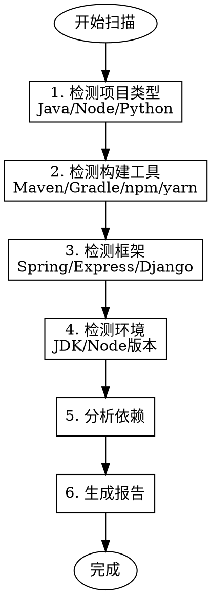

# 项目扫描器 (Project Scanner)

## 何时使用

**必须激活的条件：**
- 用户说 "扫描这个项目"
- 用户说 "分析项目结构"
- 用户说 "检测项目类型"
- 用户说 "这是什么技术栈"
- 用户请求了解项目的构建工具、框架、依赖

## 扫描流程



## 项目类型检测规则

### Java 项目

| 文件 | 项目类型 | 置信度 |
|------|---------|--------|
| `pom.xml` | Maven 项目 | 95% |
| `build.gradle` / `build.gradle.kts` | Gradle 项目 | 95% |
| `pom.xml` + Spring Boot parent | Spring Boot | 98% |

**JDK 版本检测：**
- 检查 `pom.xml` 中的 `<java.version>` 或 `<maven.compiler.source>`
- 检查 `build.gradle` 中的 `sourceCompatibility`

**Legacy 项目标记：**
- JDK 8 + Spring Boot 2.x → 标记为 `java-spring-legacy`
- JDK 17+ + Spring Boot 3.x → 标记为 `java-spring`

### Node.js 项目

| 文件 | 项目类型 | 置信度 |
|------|---------|--------|
| `package.json` | Node.js 项目 | 95% |
| `package.json` + express 依赖 | Express 项目 | 90% |
| `package.json` + next 依赖 | Next.js 项目 | 90% |

**Node 版本检测：**
- 检查 `.nvmrc`
- 检查 `package.json` 中的 `engines.node`
- 执行 `node --version`

### Python 项目

| 文件 | 项目类型 | 置信度 |
|------|---------|--------|
| `requirements.txt` | Python 项目 | 90% |
| `pyproject.toml` | 现代 Python 项目 | 95% |
| `setup.py` | 传统 Python 项目 | 85% |

## 环境验证（必须实际执行）

**铁律：NO ENVIRONMENT CLAIMS WITHOUT ACTUAL EXECUTION**

```bash
# Java 版本
java -version

# Maven 版本
mvn -version

# Node 版本
node --version

# npm/yarn 版本
npm --version
yarn --version

# Python 版本
python --version
pip --version
```

**如果执行失败：**
- 记录为环境问题
- 在报告中标注 "未安装" 或 "版本不匹配"
- 提供修复建议

## 扫描报告格式

```markdown
# 项目扫描报告

## 基本信息
- **项目类型**: java-spring
- **置信度**: 98%
- **构建工具**: Maven
- **包管理器**: 无

## 技术栈
- **语言**: Java 17
- **框架**: Spring Boot 3.2.0
- **测试框架**: JUnit 5

## 环境状态
| 工具 | 要求 | 实际 | 状态 |
|------|------|------|------|
| JDK | 17 | 17.0.2 | ✅ |
| Maven | 3.6+ | 3.9.0 | ✅ |

## 项目结构
- 文件数: 45
- 代码行数: 3,200
- 主要目录:
  - src/main/java
  - src/main/resources
  - src/test/java

## 依赖分析
- 直接依赖: 12
- 传递依赖: 45
- 过时依赖: 3

## 建议
1. 更新 spring-boot-starter-security 到最新版本
2. 考虑添加 .nvmrc 固定 Node 版本
```

## 铁律检查

扫描完成后，必须检查以下铁律：

| 铁律 | 检查项 |
|------|--------|
| IL002 | 是否有扫描结果可供后续 Harness 生成使用 |
| IL003 | 环境验证是否实际执行 |

## 输出要求

1. **必须** 实际执行环境检测命令
2. **必须** 输出 Markdown 格式报告
3. **必须** 标注置信度
4. **必须** 列出所有发现的问题
5. **应该** 提供修复建议