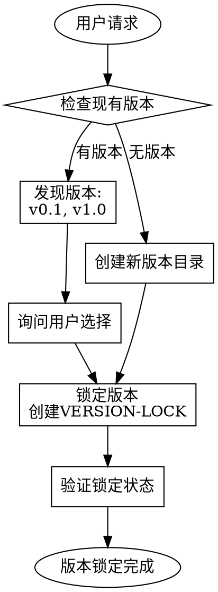

# 版本锁定器 (Version Locker)

## 铁律

```
NO DOCUMENTS WITHOUT VERSION LOCK
NO VERSION CHANGES WITHOUT USER CONSENT
```

## 何时使用

**必须激活的条件：**
- 用户说 "创建版本"
- 用户说 "锁定版本"
- 用户提到版本号如 "v0.1"、"v1.0"
- 用户请求生成文档但没有指定版本

## 版本号规则

### 格式要求

```
vX.Y

X = 主版本号 (major)
Y = 次版本号 (minor)
```

**有效示例：**
- `v0.1` - 初始版本
- `v1.0` - 首个正式版本
- `v2.3` - 第二主版本的第三次更新

**无效示例：**
- `v1` - 缺少次版本号
- `1.0` - 缺少 v 前缀
- `v1.0.0` - 不支持修订号
- `version-1` - 格式错误

### 版本建议规则

| 场景 | 建议版本 | 原因 |
|------|---------|------|
| 新项目首次 | `v0.1` | 初始探索版本 |
| 需求确认后 | `v1.0` | 正式开发版本 |
| 大版本重构 | `v2.0` | 不兼容更新 |
| 功能增强 | `vX.Y+1` | 次版本递增 |

## 版本锁定流程



## 目录结构

```
output/
├── v0.1/
│   ├── Harness/
│   │   └── harness.yaml
│   └── docs/
├── v1.0/
│   ├── Harness/
│   └── docs/
└── VERSION-LOG.md
```

## VERSION-LOCK 文件格式

```yaml
# VERSION-LOCK
# 此文件由 Chaos Harness 自动生成
# Session 内不可更改

version: v0.1
locked_at: 2026-04-02T23:00:00Z
locked_by: chaos-harness
session_id: abc123
project_root: /path/to/project

# 铁律引用
iron_law: IL001 - NO DOCUMENTS WITHOUT VERSION LOCK

# 更改此文件需要用户明确同意
```

## VERSION-LOG 文件格式

```markdown
# Version Log

## v0.1 - 2026-04-02

### 创建原因
初始版本，用于需求探索

### 锁定信息
- 锁定时间: 2026-04-02 23:00
- 锁定者: chaos-harness
- Session ID: abc123

### 包含内容
- Harness 配置
- 初始设计文档

---

## v1.0 - 2026-04-03

### 创建原因
需求确认，正式开发

...
```

## 铁律检查

### IL001: 无版本锁定，不生成文档

**检查时机：** 在生成任何文档之前

**检查逻辑：**
```
IF 要生成文档 THEN
    IF 版本未锁定 THEN
        必须先请求用户创建/选择版本
        等待版本锁定后才能继续
    END IF
END IF
```

### IL004: 无用户同意，不更改版本

**检查时机：** 用户请求更改版本时

**检查逻辑：**
```
IF 版本已锁定 AND 用户未明确同意更改 THEN
    警告: 当前版本为 vX.Y
    询问: 是否要更改到新版本？
    等待用户明确同意
END IF
```

## 交互示例

**场景1：首次创建版本**

```
用户: 帮我创建一个版本

Claude: 好的，我需要创建一个版本目录。

当前项目没有检测到版本目录。
建议使用 v0.1 作为初始版本。

请确认是否使用 v0.1？
或者指定其他版本号？

用户: 用 v0.1 吧

Claude: [创建版本目录]
        [生成 VERSION-LOCK]
        
✅ 版本已锁定: v0.1
        
所有后续文档将生成在 output/v0.1/ 目录下。
如需更改版本，请明确告知。
```

**场景2：检测到现有版本**

```
用户: 帮我锁定版本

Claude: 检测到现有版本目录：
        - v0.1 (2026-04-02)
        - v1.0 (2026-04-03)
        
请选择要使用的版本：
1. v0.1
2. v1.0
3. 创建新版本

用户: 用 v1.0

Claude: ✅ 版本已锁定: v1.0
        
当前 Session 内版本号不可更改。
所有文档将生成在 output/v1.0/ 目录下。
```

**场景3：尝试更改已锁定版本**

```
用户: 改成 v2.0

Claude: ⚠️ 当前版本已锁定为 v1.0

铁律 IL004: 无用户同意，不更改版本

你确定要将版本从 v1.0 更改到 v2.0 吗？
这将影响后续所有文档的生成位置。

用户: 是的，确定更改

Claude: ✅ 版本已更新: v2.0
        
已重新锁定版本。
所有后续文档将生成在 output/v2.0/ 目录下。
```