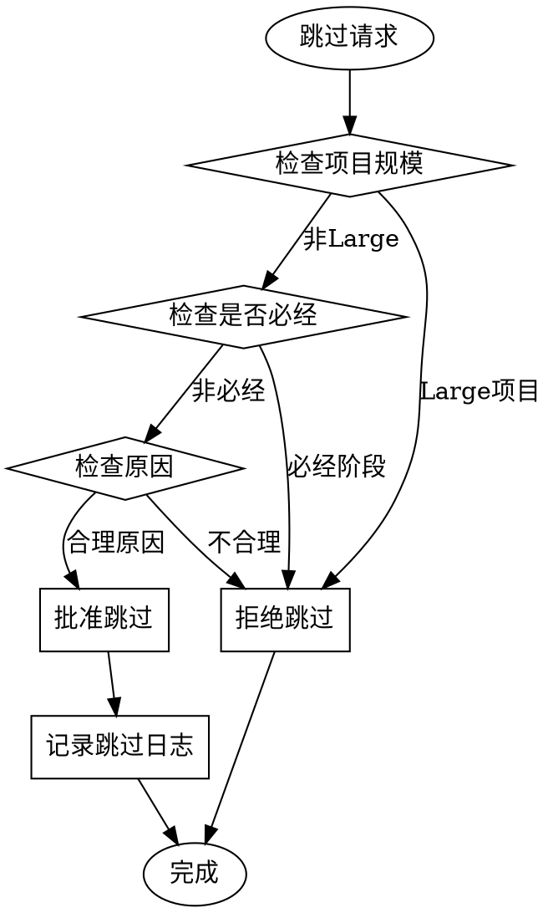

# 工作流监督器 (Workflow Supervisor)

## 执行规则

**加载此 skill 后，你必须执行以下步骤：**

### Step 1: 判断项目规模

使用 Glob 和 Grep 统计：
- 文件数量
- 代码行数

根据结果判定规模：

| 规模 | 文件数 | 代码行数 |
|------|--------|---------|
| Small | ≤5 | ≤100 |
| Medium | 5-20 | 100-500 |
| Large | ≥20 | ≥500 |

### Step 2: 显示必经阶段

根据规模输出必经阶段：

**Small:** W01, W03, W08, W09, W12
**Medium:** W01, W02, W03, W05, W08, W09, W10, W12
**Large:** 全部 12 阶段

### Step 3: 创建工作流状态文件

使用 Write 工具创建 `.chaos-harness/state.json`（统一状态文件）：

```json
{
  "project_name": "{从项目配置提取}",
  "project_root": "{当前路径}",
  "harness_version": "1.2.0",
  "created_at": "{timestamp}",
  "last_session": "{timestamp}",
  "current_version": null,
  "workflow": {
    "scale": "{scale}",
    "current_stage": "W01",
    "stage_start_time": "{timestamp}",
    "stages_completed": [],
    "stages_pending": ["W01", "W02", ...],
    "stages_skipped": []
  },
  "scan_result": null,
  "statistics": {
    "total_sessions": 1,
    "total_duration_minutes": 0,
    "iron_law_triggers": 0,
    "bypass_attempts": 0
  }
}
```

### Step 3.5: 阶段状态更新机制

**每个阶段完成时必须更新状态文件**：

```
阶段完成 → 调用 updateStageStatus(stage, 'completed')
    ↓
更新 .chaos-harness/state.json:
├── stages_completed: 添加当前阶段
├── stages_pending: 移除当前阶段
├── current_stage: 设置为下一阶段
└── last_session: 更新时间戳
```

**状态更新代码**：
```typescript
function updateStageStatus(stage: string, status: 'completed' | 'skipped' | 'blocked') {
  const state = readStateFile();
  
  if (status === 'completed') {
    state.workflow.stages_completed.push({
      stage,
      completed_at: new Date().toISOString()
    });
  } else if (status === 'skipped') {
    state.workflow.stages_skipped.push({
      stage,
      reason: 'user_approved',
      timestamp: new Date().toISOString()
    });
  }
  
  // 移除 from pending
  state.workflow.stages_pending = state.workflow.stages_pending.filter(s => s !== stage);
  
  // 更新当前阶段
  const nextStage = getNextStage(stage);
  if (nextStage) {
    state.workflow.current_stage = nextStage;
    state.workflow.stage_start_time = new Date().toISOString();
  }
  
  state.last_session = new Date().toISOString();
  writeStateFile(state);
}
```

### Step 3.6: 扫描结果文件

如果不存在 `output/{version}/scan-result.json`，使用已有数据创建：

```json
{
  "projectType": "{detected type}",
  "version": "{version}",
  "backendFiles": {count},
  "frontendFiles": {count},
  "jdk": "{detected version}",
  "springBoot": "{detected version}",
  "scanTime": "{timestamp}"
}
```

### Step 4: 输出当前状态

```
┌─────────────────────────────────────────────────────────────┐
│  工作流状态                                                  │
├─────────────────────────────────────────────────────────────┤
│  项目规模: {scale}                                           │
│  当前阶段: {stage}                                           │
│  必经阶段: {required stages}                                 │
│  可跳过: {skippable stages}                                  │
└─────────────────────────────────────────────────────────────┘
```

## 何时使用

**必须激活的条件：**
- 用户说 "创建工作流"
- 用户说 "查看工作流状态"
- 用户提到阶段名称如 "需求阶段"、"开发阶段"
- 用户请求跳过某个阶段

## 12 阶段工作流


## 阶段定义

| 阶段 | 名称 | 输入 | 输出 | 角色 |
|------|------|------|------|------|
| W01 | 需求设计 | 项目描述 | 需求文档 | architect |
| W02 | 需求评审 | 需求文档 | 评审报告 | **agent-team-orchestrator** (自动启动 3 个评审 Agent) |
| W03 | 架构设计 | 需求文档 | 架构文档 | architect |
| W04 | 架构评审 | 架构文档 | 评审报告 | **agent-team-orchestrator** (自动启动 3 个评审 Agent) |
| W05 | 技术选型 | 架构文档 | 技术方案 | architect |
| W06 | API设计 | 技术方案 | API文档 | backend_dev |
| W07 | Agent分配 | 全部文档 | 分配方案 | **agent-team-orchestrator** (自动拆分任务) |
| W08 | 开发实现 | 设计文档 | 代码 | **agent-team-orchestrator** (自动启动并行开发) |
| W09 | 代码审查 | 代码 | 审查报告 | **agent-team-orchestrator** (自动启动 3 个审查 Agent) |
| W10 | 测试验证 | 代码 | 测试报告 | tester |
| W11 | 文档完善 | 全部产出 | 文档 | backend_dev |
| W12 | 发布部署 | 全部产出 | 发布包 + **effectiveness-log** | backend_dev |

## 自适应流程

### 项目规模判定

| 规模 | 文件数 | 代码行数 | 说明 |
|------|--------|---------|------|
| Small | ≤5 | ≤100 | 单文件/小工具 |
| Medium | 5-20 | 100-500 | 标准功能模块 |
| Large | ≥20 | ≥500 | 多模块项目 |

### 规模升级条件

即使文件数/行数未达到阈值，以下情况**必须升级到 Large**：

- 有复杂架构（微服务、分布式）
- 有多个独立模块
- 涉及多个技术栈
- 需要多团队协作

### 必经阶段配置

| 规模 | 必经阶段 | 可跳过阶段 |
|------|---------|-----------|
| Small | W01, W03, W08, W09, W12 | W02, W04, W05, W06, W07, W10, W11 |
| Medium | W01, W02, W03, W05, W08, W09, W10, W12 | W04, W06, W07, W11 |
| Large | **全部 12 阶段** | 无 |

### 铁律 IL001: 大型项目无例外

```
LARGE PROJECTS CANNOT SKIP ANY STAGE
```

大型项目所有阶段必经，不允许跳过请求。

## 状态机

### 阶段状态

```
pending → in_progress → completed
    ↓           ↓
  skipped    blocked
```

### 转换规则

| 从 | 到 | 条件 |
|---|-----|------|
| pending | in_progress | 前置阶段完成 |
| in_progress | completed | 阶段产出完成 + 验证通过 |
| pending | skipped | 用户批准 + 非必经阶段 |
| in_progress | blocked | 检测到阻塞问题 |

### 自动触发 Agent Team

**⚠️ 防止循环检测：**
- 此 skill 不会自动加载其他 skill
- 只输出推荐信息，由用户决定是否执行
- 推荐信息不会重复输出（同一阶段只推荐一次）

以下阶段到达时，**推荐**用户启动 Agent Team：

```
W02 需求评审 → 推荐: /chaos-harness:agent-team-orchestrator
W04 架构评审 → 推荐: /chaos-harness:agent-team-orchestrator
W07 Agent分配 → 推荐: /chaos-harness:agent-team-orchestrator
W08 开发实现 → 推荐: /chaos-harness:agent-team-orchestrator
W09 代码审查 → 推荐: /chaos-harness:agent-team-orchestrator
```

**推荐输出格式**：
```
<HARNESS_RECOMMEND>
📌 当前阶段: W04 架构评审

建议启动 Agent Team 进行多视角评审：
- 架构师: 架构合理性
- 安全专家: 安全风险
- 高级开发: 实现可行性

使用命令: /chaos-harness:agent-team-orchestrator
</HARNESS_RECOMMEND>
```

**注意**：推荐不会自动执行，需要用户确认。

## 跳过请求处理

### 检查流程



### 拒绝理由模板

**大型项目：**
```
🚫 跳过请求被拒绝

项目规模: Large
请求阶段: W02_requirements_review

铁律 IL001: 大型项目不能跳过任何阶段。

原因: 大型项目复杂度高，所有阶段都是必要的质量保障。
```

**必经阶段：**
```
🚫 跳过请求被拒绝

项目规模: Medium
请求阶段: W08_development

阶段类型: 必经阶段

原因: 此阶段是当前规模项目的必经阶段，不能跳过。
```

## 偷懒检测集成

### 检测时机

- 阶段超时（超过预期时间 150%）
- 声称完成但无产出
- 请求跳过必经阶段
- 长时间无进度更新

### 检测逻辑

```typescript
function detectWorkflowLaziness(state, context) {
  const patterns = [];

  // 检查阶段超时
  const currentStage = state.currentStage;
  const elapsed = Date.now() - state.stageStartTime;
  const expected = getStageExpectedTime(currentStage, state.scale);

  if (elapsed > expected * 1.5) {
    patterns.push({
      pattern: 'LP003',
      stage: currentStage,
      elapsed,
      expected
    });
  }

  // 检查产出缺失
  if (context.claimedCompletion && !context.hasOutput) {
    patterns.push({
      pattern: 'LP001',
      stage: currentStage
    });
  }

  return patterns;
}
```

## 工作流报告格式

```markdown
# 工作流状态报告

## 项目信息
- **规模**: Medium
- **当前阶段**: W08_development
- **开始时间**: 2026-04-02 22:00
- **已运行**: 2小时

## 阶段进度

| 阶段 | 状态 | 开始时间 | 完成时间 |
|------|------|---------|---------|
| W01 需求设计 | ✅ 完成 | 22:00 | 22:30 |
| W02 需求评审 | ⏭️ 跳过 | - | - |
| W03 架构设计 | ✅ 完成 | 22:30 | 23:00 |
| W04 架构评审 | ⏭️ 跳过 | - | - |
| W05 技术选型 | ✅ 完成 | 23:00 | 23:15 |
| W06 API设计 | ⏭️ 跳过 | - | - |
| W07 Agent分配 | ⏭️ 跳过 | - | - |
| W08 开发实现 | 🔄 进行中 | 23:15 | - |
| W09 代码审查 | ⏳ 待开始 | - | - |
| W10 测试验证 | ⏳ 待开始 | - | - |
| W11 文档完善 | ⏭️ 跳过 | - | - |
| W12 发布部署 | ⏳ 待开始 | - | - |

## 跳过日志
| 阶段 | 原因 | 批准时间 |
|------|------|---------|
| W02 | 小型评审无需独立阶段 | 22:25 |
| W04 | 架构已在W03中评审 | 23:00 |

## 违规记录
无

## 建议
1. W08 阶段已运行 45 分钟，请确保进度正常
2. 完成后记得运行测试验证
```

## 铁律检查

| 铁律 | 检查项 |
|------|--------|
| IL001 | 大型项目不允许跳过任何阶段 |
| IL003 | 阶段完成需要验证证据 |
| IL004 | 更改工作流配置需要用户同意 |

## 效果追踪

**阶段完成后更新效果日志：**

使用 `shared/helpers.md#Update-Effectiveness-Log` 写入：
```
output/{version}/effectiveness-log.md
```

统计内容：
- 铁律触发次数
- 防绕过触发次数
- 偷懒模式检测次数
- 阶段效果评分

**自学习闭环：**
1. 阶段完成 → Update-Effectiveness-Log
2. 效果数据 → learning-analyzer 分析
3. 发现问题 → 优化工作流
4. 下次运行 → 更高效